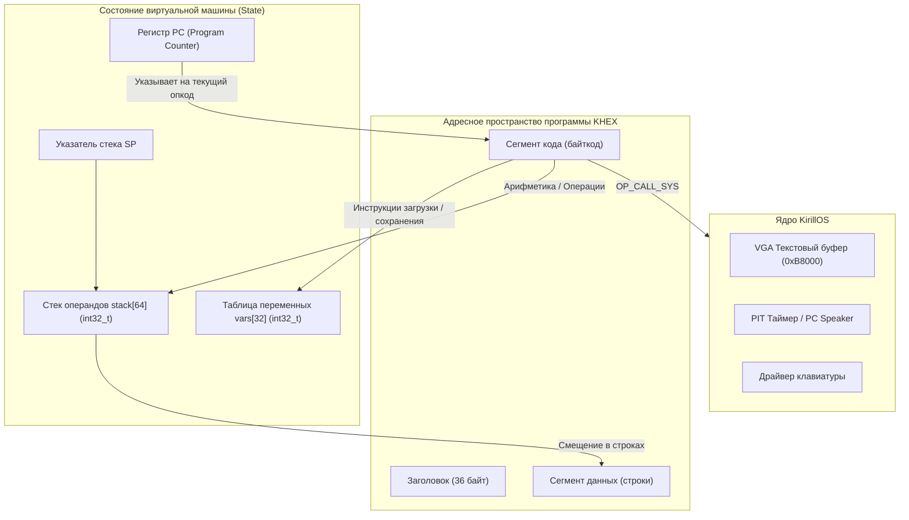

# Архитектура виртуальной машины KHEX VM и формат исполняемых файлов

**KHEX Virtual Machine (KHEX VM)** — это компактная, высокопроизводительная стековая виртуальная машина, встроенная в ядро операционной системы **KirillOS** ([`khexd.c`](file:///d:/cppproject/KirillOS/khexd.c#L687-L870)). Она предназначена для безопасного и изолированного исполнения переносимого байткода с прямым доступом к системным службам ядра через унифицированный интерфейс системных вызовов `OP_CALL_SYS`.

---

## 📑 Содержание
1. [Архитектурная модель виртуальной машины](#1-архитектурная-модель-виртуальной-машины)
   - [Регистр счетчика команд (PC)](#11-регистр-счетчика-команд-pc)
   - [Стек данных (Evaluation Stack)](#12-стек-данных-evaluation-stack)
   - [Таблица статических переменных (Variables Store)](#13-таблица-статических-переменных-variables-store)
   - [Сегмент строковых констант](#14-сегмент-строковых-констант)
2. [Полная спецификация опкодов (Instruction Set Architecture)](#2-полная-спецификация-опкодов-instruction-set-architecture)
   - [Управление стеком и памятью](#21-управление-стеком-и-памятью)
   - [Арифметические операции](#22-арифметические-операции)
   - [Операции сравнения и логики](#23-операции-сравнения-и-логики)
   - [Управление потоком управления (Jumps)](#24-управление-потоком-управления-jumps)
   - [Системные прерывания и завершение](#25-системные-прерывания-и-завершение)
3. [Спецификация системных вызовов (Syscalls API)](#3-спецификация-системных-вызовов-syscalls-api)
4. [Бинарный формат исполняемого файла .khex](#4-бинарный-формат-исполняемого-файла-khex)
   - [Заголовок khex_exec_header_t (36 байт)](#41-заголовок-khex_exec_header_t-36-байт)
   - [Карта памяти файла](#42-карта-памяти-файла)
5. [Руководство по созданию программ вручную в hex-редакторе kdhe](#5-руководство-по-созданию-программ-вручную-в-hex-редакторе-kdhe)
   - [Побайтовый разбор 59-байтового Hello World](#51-побайтовый-разбор-59-байтового-hello-world)
   - [Пошаговый ввод в kdhe и запуск в KirillOS](#52-пошаговый-ввод-в-kdhe-и-запуск-в-kirillos)

---

## 1. Архитектурная модель виртуальной машины

Виртуальная машина KHEX VM является **стековой машиной с нулевым адресом** (zero-address stack machine). Инструкции берут операнды с вершины стека и помещают результат обратно на вершину.



### 1.1 Регистр счетчика команд (PC)
- **`uint32_t pc`**: Смещение относительно начала сегмента байткода (`code`).
- Инкрементируется по мере считывания опкода и его аргументов.
- Изменяется инструкциями безусловного (`OP_JMP`) и условных переходов (`OP_JZ`, `OP_JNZ`).
- Завершение программы наступает при достижении `pc >= hdr->code_size` либо при выполнении опкода `OP_EXIT`.

### 1.2 Стек данных (Evaluation Stack)
- **`int32_t stack[64]`**: Фиксированный стек на 64 элемента типа 32-битное знаковое целое.
- **`int sp`**: Указатель вершины стека (Stack Pointer). При инициализации `sp = 0`.
- При вычислении бинарных операций (например, сложение `A + B`):
  1. Второе слагаемое `B` снимается со стека (`stack[--sp]`).
  2. Первое слагаемое `A` находится в `stack[sp - 1]`.
  3. Результат записывается в `stack[sp - 1]`.

### 1.3 Таблица статических переменных (Variables Store)
- **`int32_t vars[32]`**: Массив из 32 статических ячеек памяти.
- Адресуется по 8-битному индексу `0x00 .. 0x1F`.
- Инициализируется нулями перед стартом программы.

### 1.4 Сегмент строковых констант
- Располагается сразу за сегментом инструкций по смещению:
  `entry_offset + code_size`.
- Содержит нуль-терминированные ASCII-строки. При передаче строки в системный вызов на стек кладется 32-битное смещение строки относительно начала сегмента данных.

---

## 2. Полная спецификация опкодов (Instruction Set Architecture)

Все инструкции кодируются одним байтом опкода (Opcode), за которым могут следовать непосредственные операнды.

### 2.1 Управление стеком и памятью

| Мнемоника | Опкод (HEX) | Длина | Операнды | Влияние на стек | Описание |
| :--- | :---: | :---: | :--- | :---: | :--- |
| `OP_NOP` | `0x00` | 1 байт | Нет | `[ ... ] -> [ ... ]` | Пустая операция (No Operation). Переход к следующему байту. |
| `OP_PUSH_CONST` | `0x01` | 5 байт | `val: int32_t` (little-endian) | `[ ... ] -> [ ..., val ]` | Помещает 32-битное константное число `val` на вершину стека. |
| `OP_LOAD_VAR` | `0x02` | 2 байта | `idx: uint8_t` (0..31) | `[ ... ] -> [ ..., vars[idx] ]` | Загружает значение из ячейки переменных `vars[idx]` на вершину стека. |
| `OP_STORE_VAR` | `0x03` | 2 байта | `idx: uint8_t` (0..31) | `[ ..., val ] -> [ ... ]` | Снимает значение `val` со стека и записывает в `vars[idx]`. |

### 2.2 Арифметические операции
Все арифметические операции производятся над 32-битными знаковыми целыми числами:

| Мнемоника | Опкод (HEX) | Длина | Операнды | Влияние на стек | Описание |
| :--- | :---: | :---: | :--- | :---: | :--- |
| `OP_ADD` | `0x04` | 1 байт | Нет | `[ a, b ] -> [ a + b ]` | Целочисленное сложение. |
| `OP_SUB` | `0x05` | 1 байт | Нет | `[ a, b ] -> [ a - b ]` | Вычитание: `a - b`. |
| `OP_MUL` | `0x06` | 1 байт | Нет | `[ a, b ] -> [ a * b ]` | Целочисленное умножение. |
| `OP_DIV` | `0x07` | 1 байт | Нет | `[ a, b ] -> [ a / b ]` | Целочисленное деление с отсечением. Защита от деления на 0. |
| `OP_MOD` | `0x08` | 1 байт | Нет | `[ a, b ] -> [ a % b ]` | Остаток от целочисленного деления. |

### 2.3 Операции сравнения и логики
Операции сравнения снимают со стека два операнда и возвращают `1`, если условие истинно, или `0`, если ложно.

| Мнемоника | Опкод (HEX) | Длина | Операнды | Влияние на стек | Описание |
| :--- | :---: | :---: | :--- | :---: | :--- |
| `OP_EQ` | `0x09` | 1 байт | Нет | `[ a, b ] -> [ a == b ? 1 : 0 ]` | Проверка на равенство. |
| `OP_NEQ` | `0x0A` | 1 байт | Нет | `[ a, b ] -> [ a != b ? 1 : 0 ]` | Проверка на неравенство. |
| `OP_LT` | `0x0B` | 1 байт | Нет | `[ a, b ] -> [ a < b ? 1 : 0 ]` | Сравнение «Меньше чем». |
| `OP_GT` | `0x0C` | 1 байт | Нет | `[ a, b ] -> [ a > b ? 1 : 0 ]` | Сравнение «Больше чем». |
| `OP_LTE` | `0x0D` | 1 байт | Нет | `[ a, b ] -> [ a <= b ? 1 : 0 ]` | Сравнение «Меньше либо равно». |
| `OP_GTE` | `0x0E` | 1 байт | Нет | `[ a, b ] -> [ a >= b ? 1 : 0 ]` | Сравнение «Больше либо равно». |

### 2.4 Управление потоком управления (Jumps)
Смещения переходов указывают на абсолютный байт внутри сегмента кода (`0 .. code_size - 1`).

| Мнемоника | Опкод (HEX) | Длина | Операнды | Влияние на стек | Описание |
| :--- | :---: | :---: | :--- | :---: | :--- |
| `OP_JMP` | `0x10` | 3 байта | `tgt: uint16_t` | `[ ... ] -> [ ... ]` | Безусловный переход: `pc = tgt`. |
| `OP_JZ` | `0x11` | 3 байта | `tgt: uint16_t` | `[ ..., cond ] -> [ ... ]` | Переход по нулю (Jump if Zero): если `cond == 0`, то `pc = tgt`. |
| `OP_JNZ` | `0x12` | 3 байта | `tgt: uint16_t` | `[ ..., cond ] -> [ ... ]` | Переход по не-нулю (Jump if Not Zero): если `cond != 0`, то `pc = tgt`. |

### 2.5 Системные прерывания и завершение

| Мнемоника | Опкод (HEX) | Длина | Операнды | Влияние на стек | Описание |
| :--- | :---: | :---: | :--- | :---: | :--- |
| `OP_CALL_SYS`| `0x20` | 2 байта | `sys_id: uint8_t` | Зависит от `sys_id` | Вызов системной функции ядра KirillOS с передачей аргументов через стек. |
| `OP_EXIT` | `0xFF` | 1 байт | Нет | `[ ... ] -> [ ... ]` | Корректное завершение работы программы и выход в командную строку. |

---

## 3. Спецификация системных вызовов (Syscalls API)

Инструкция `OP_CALL_SYS` (`0x20`) принимает один байт номера системного вызова `sys_id`:

| ID | Имя Syscall | Аргументы на стеке (порядок снятия) | Возвращает на стек | Описание |
| :---: | :--- | :--- | :---: | :--- |
| `1` | `SYS_PRINT_STR` | `offset: int32_t` (смещение строки) | Нет | Печатает нуль-терминированную строку из секции данных в текущую позицию курсора. |
| `2` | `SYS_PRINT_NUM` | `val: int32_t` | Нет | Форматирует и выводит 32-битное число в десятичном виде (со знаком `-` при необходимости). |
| `3` | `SYS_PUTCHAR` | `ch: int32_t` (ASCII код) | Нет | Выводит одиночный символ в консоль. |
| `4` | `SYS_CLEAR` | Нет | Нет | Очищает экран VGA и переводит курсор в `(0, 0)`. |
| `5` | `SYS_SET_COLOR` | 1) `fg: uint8_t`<br>2) `bg: uint8_t` | Нет | Устанавливает цвет текста и фона консоли. |
| `6` | `SYS_SET_CURSOR`| 1) `row: uint32_t`<br>2) `col: uint32_t` | Нет | Устанавливает аппаратный курсор VGA (`0..24`, `0..79`). |
| `7` | `SYS_DRAW_CHAR` | 1) `row: uint32`<br>2) `col: uint32`<br>3) `ch: char`<br>4) `color: uint8` | Нет | Прямая запись символа и цвета в видеопамять VGA `0xB8000`. |
| `8` | `SYS_GETCHAR` | Нет | `ch: int32_t` | Блокирующее чтение символа с клавиатуры. |
| `9` | `SYS_POLLCHAR` | Нет | `ch: int32_t` | Неблокирующее чтение (возвращает `0`, если клавиша не нажата). |
| `11`| `SYS_BEEP` | 1) `freq: uint32_t` (Гц)<br>2) `ms: uint32_t` (мс) | Нет | Воспроизводит звук через PC Speaker с аппаратным ожиданием. |
| `12`| `SYS_DELAY` | `ms: uint32_t` | Нет | Аппаратная пауза на заданное количество миллисекунд (таймер PIT). |
| `13`| `SYS_RAND` | `max: int32_t` | `res: int32_t` | Генерирует псевдослучайное число от `0` до `max - 1`. |

---

## 4. Бинарный формат исполняемого файла .khex

### 4.1 Заголовок khex_exec_header_t (36 байт)

Файл `.khex` начинается с упакованной 36-байтовой структуры заголовка:

```c
typedef struct {
    uint32_t magic;          /* 0x00: 0x4B484558 ('KHEX') */
    uint16_t version;        /* 0x04: 0x0002 */
    uint16_t flags;          /* 0x06: 1 = байткод ВМ, 2 = нативный бинарник */
    uint32_t entry_offset;   /* 0x08: Смещение до точки входа (36 = 0x24) */
    uint32_t code_size;      /* 0x0C: Размер секции байткода в байтах */
    uint32_t data_size;      /* 0x10: Размер секции данных/строк в байтах */
    char     name[16];       /* 0x14: Имя программы (ASCII, нуль-терминировано) */
} __attribute__((packed)) khex_exec_header_t;
```

#### Побайтовая карта заголовка:
| Смещение | Размер | Поле | Значение по умолчанию | Значение в HEX (Little-Endian) |
| :---: | :---: | :--- | :--- | :--- |
| `0x00` | 4 байта | `magic` | `0x4B484558` | `58 45 48 4B` |
| `0x04` | 2 байта | `version` | `0x0002` | `02 00` |
| `0x06` | 2 байта | `flags` | `0x0001` (Байткод) | `01 00` |
| `0x08` | 4 байта | `entry_offset` | `36` (`0x00000024`) | `24 00 00 00` |
| `0x0C` | 4 байта | `code_size` | Длина байткода | `XX XX XX XX` |
| `0x10` | 4 байта | `data_size` | Длина строк | `YY YY YY YY` |
| `0x14` | 16 байт | `name` | Строка имени файла | До 16 ASCII байт с нулями |

### 4.2 Карта памяти файла
```
Смещение:
+0x0000  [=========================================]
         | Заголовок khex_exec_header_t (36 байт)  |
+0x0024  [=========================================]
         | Сегмент байткода (code_size байт)       |
         | Инструкции: OP_PUSH_CONST, OP_CALL...   |
+0x0024  [=========================================]
+code_sz | Сегмент данных (data_size байт)         |
         | Строки: "Hello World!\n\0"              |
         [=========================================]
```

---

## 5. Руководство по созданию программ вручную в hex-редакторе kdhe

Шестнадцатеричный редактор **`kdhe`** в KirillOS позволяет создавать работающие программы абсолютно с нуля, байт за байтом, без компилятора.

### 5.1 Побайтовый разбор 59-байтового Hello World

Создадим минимальную программу `hello.khex`, которая выводит на экран строку `"Hello, World!\n"` и завершает работу.

Общий размер файла: **59 байт**:
- Заголовок: **36 байт**
- Байткод: **8 байт**
- Строка: **15 байт**

#### Полная таблица байт (59 байт):

```text
Смещение  HEX Байты                 Мнемоника / Назначение
---------------------------------------------------------------------------------
[СЕКЦИЯ ЗАГОЛОВКА - 36 байт]
0000:     58 45 48 4B               magic = 'KHEX' (0x4B484558)
0004:     02 00                     version = 2
0006:     01 00                     flags = 1 (Байткод виртуальной машины)
0008:     24 00 00 00               entry_offset = 36 (0x24) - сразу за заголовком
000C:     08 00 00 00               code_size = 8 байт
0010:     0F 00 00 00               data_size = 15 байт (0x0F)
0014:     68 65 6C 6C 6F 00 00 00   name[16] = "hello\0..."
001C:     00 00 00 00 00 00 00 00   ...заполнение нулями до 16 байт

[СЕКЦИЯ БАЙТКОДА - 8 байт]
0024:     01                        OP_PUSH_CONST
0025:     00 00 00 00               imm32 = 0 (Смещение 0 в пуле данных)
0029:     20                        OP_CALL_SYS
002A:     01                        sys_id = 1 (SYS_PRINT_STR)
002B:     FF                        OP_EXIT (Завершение программы)

[СЕКЦИЯ СТРОКОВЫХ ДАННЫХ - 15 байт]
002C:     48 65 6C 6C 6F 2C 20 57   "Hello, W"
0034:     6F 72 6C 64 21 0A 00      "orld!\n\0"
---------------------------------------------------------------------------------
```

### 5.2 Пошаговый ввод в kdhe и запуск в KirillOS

1. **Создайте файл в консоли KirillOS:**
   ```text
   touch hello.khex
   ```
2. **Откройте файл в редакторе Kdhe:**
   ```text
   kdhe hello.khex
   ```
3. **Введите приведенную выше шестнадцатеричную последовательность байт:**
   ```text
   58 45 48 4B 02 00 01 00 24 00 00 00 08 00 00 00
   0F 00 00 00 68 65 6C 6C 6F 00 00 00 00 00 00 00
   00 00 00 00 01 00 00 00 00 20 01 FF 48 65 6C 6C
   6F 2C 20 57 6F 72 6C 64 21 0A 00
   ```
4. **Сохраните файл и выйдите:**
   Нажмите **F2** (сохранить изменения на диск) и **ESC** (выйти в командную строку).
5. **Проверьте информацию о бинарнике:**
   ```text
   khex info hello.khex
   ```
   *Вывод покажет размер (59 bytes), адрес загрузки и сигнатуру `58 45 48 4B`.*
6. **Запустите программу:**
   ```text
   khex run hello.khex
   ```
   *На экране отобразится строка:*
   ```text
   [KHEX] Executing KHEX binary 'hello.khex'...

   Hello, World!

   [KHEX] Process terminated with return code: 0
   ```
