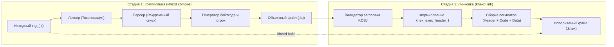

# Внутреннее устройство компилятора и линковщика KHEXD

**KHEXD** (KirillOS Hex Daemon / Compiler & Linker) — это интегрированный в ядро операционной системы тулчейн, отвечающий за синтаксический анализ программ на языке K, генерацию байткода виртуальной машины KHEX VM, упаковку промежуточных объектных файлов `.ko` и компоновку исполняемых бинарных файлов `.khex`.

Исходный код подсистемы сосредоточен в файлах:
- [`khexd.h`](file:///d:/cppproject/KirillOS/khexd.h) — интерфейсы компилятора, структуры заголовков и сигнатуры;
- [`khexd.c`](file:///d:/cppproject/KirillOS/khexd.c) — реализация лексера, парсера, линковщика и интерпретатора;
- [`kernel.c`](file:///d:/cppproject/KirillOS/kernel.c#L423-L497) — интерфейс командной строки команд `khexd`.

---

## 📑 Содержание
1. [Архитектура двухстадийной сборки](#1-архитектура-двухстадийной-сборки)
2. [Лексический анализ (Лексер / Токенизатор)](#2-лексический-анализ-лексер--токенизатор)
3. [Синтаксический анализ (Парсер) и кодогенерация](#3-синтаксический-анализ-парсер-и-кодогенерация)
   - [Таблица идентификаторов (переменных)](#31-таблица-идентификаторов-переменных)
   - [Парсер выражений и приоритеты](#32-парсер-выражений-и-приоритеты)
   - [Бэкпатчинг адресов переходов (if, while)](#33-бэкпатчинг-адресов-переходов-if-while)
4. [Формат объектного файла .ko (K-Object)](#4-формат-объектного-файла-ko-k-object)
5. [Процесс компоновки (Линковщик)](#5-процесс-компоновки-линковщик)
6. [Формат исполняемого файла .khex](#6-формат-исполняемого-файла-khex)
7. [Консольные команды тулчейна KHEXD](#7-консольные-команды-тулчейна-khexd)

---

## 1. Архитектура двухстадийной сборки

Сборка программ в KirillOS разделена на независимые стадии компиляции и компоновки (линковки), повторяя классическую архитектуру промышленных компиляторов (GCC, Clang), но с минимальным потреблением оперативной памяти:



---

## 2. Лексический анализ (Лексер / Токенизатор)

Лексер сканирует входящий поток символов из файла KirillFS с помощью глобального указателя `static const char* src_ptr` и выделяет лексические единицы (токены).

### Структура токена:
```c
typedef struct {
    token_type_t type;         /* Тип лексемы */
    int32_t      num_val;      /* Целочисленное значение (для TOK_NUM) */
    char         str_val[64];  /* Строковое значение / имя идентификатора */
} token_t;
```

### Логика работы лексера (`next_token`):
1. **Пропуск незначащих символов:** Пропускаются пробелы (`' '`), знаки табуляции (`'\t'`), возвраты каретки (`'\r'`) и переводы строк (`'\n'`).
2. **Пропуск комментариев:** При обнаружении последовательности `//` лексер считывает символы до конца строки (`\n`).
3. **Строковые литералы (`TOK_STR`):** При обнаружении символа `"` считываются символы до закрывающей кавычки.
4. **Числовые литералы (`TOK_NUM`):** Последовательность цифр `0-9` преобразуется в `int32_t` аккумулятор: `val = val * 10 + (c - '0')`.
5. **Идентификаторы и ключевые слова:** Имена начинаются с латинской буквы или `_`, могут содержать цифры. Лексер сопоставляет имя с таблицей ключевых слов:
   - Управление: `var`, `if`, `while`, `break`, `fn`.
   - Процедуры терминала: `print`, `color`, `clear`, `cursor`, `draw`.
   - Системные функции: `beep`, `delay`, `rand`, `getchar`, `poll`.
   - Если совпадений нет — токен помечается как пользовательский `TOK_IDENT`.
6. **Операторы и разделители:** Одиночные символы `{`, `}`, `(`, `)`, `,`, `+`, `-`, `*`, `/`, `%` и составные операторы `==`, `!=`, `<=`, `>=`.

---

## 3. Синтаксический анализ (Парсер) и кодогенерация

Парсер построен по методу **рекурсивного спуска** (Recursive Descent Parser). Он выполняет одновременно синтаксический разбор конструкций языка и непосредственную генерацию инструкций байткода виртуальной машины KHEX VM.

### 3.1 Таблица идентификаторов (переменных)
Компилятор поддерживает статическую таблицу имен идентификаторов:
```c
static char var_names[32][16];
static int  var_count = 0;
```
При встрече имени переменной вызывается функция `find_or_add_var(const char* name)`:
- Если переменная уже зарегистрирована, возвращается ее индекс `0..31`.
- Если это новое имя, оно добавляется в таблицу под следующим свободным индексом.
- Доступ к переменной в виртуальной машине транслируется в опкоды:
  - `OP_LOAD_VAR [idx:uint8]` — чтение значения переменной на стек.
  - `OP_STORE_VAR [idx:uint8]` — снятие значения со стека и запись в переменную.

### 3.2 Парсер выражений и приоритеты
Парсинг математических и логических выражений разбит на уровни грамматики для обеспечения математически корректного приоритета операций:

```c
static void parse_expression(void) {
    parse_comparison();       // ==, !=, <, >, <=, >=
}

static void parse_comparison(void) {
    parse_additive();         // +, -
    while (cur_tok.type >= TOK_EQ && cur_tok.type <= TOK_GTE) {
        token_type_t op = cur_tok.type;
        next_token();
        parse_additive();
        if (op == TOK_EQ)  emit_byte(OP_EQ);
        if (op == TOK_NEQ) emit_byte(OP_NEQ);
        if (op == TOK_LT)  emit_byte(OP_LT);
        if (op == TOK_GT)  emit_byte(OP_GT);
        if (op == TOK_LTE) emit_byte(OP_LTE);
        if (op == TOK_GTE) emit_byte(OP_GTE);
    }
}

static void parse_additive(void) {
    parse_multiplicative();   // *, /, %
    while (cur_tok.type == TOK_PLUS || cur_tok.type == TOK_MINUS) {
        token_type_t op = cur_tok.type;
        next_token();
        parse_multiplicative();
        if (op == TOK_PLUS) emit_byte(OP_ADD);
        else emit_byte(OP_SUB);
    }
}

static void parse_multiplicative(void) {
    parse_primary();          // Литералы, переменные, вызовы функций
    while (cur_tok.type == TOK_STAR || cur_tok.type == TOK_SLASH || cur_tok.type == TOK_PERCENT) {
        token_type_t op = cur_tok.type;
        next_token();
        parse_primary();
        if (op == TOK_STAR) emit_byte(OP_MUL);
        else if (op == TOK_SLASH) emit_byte(OP_DIV);
        else if (op == TOK_PERCENT) emit_byte(OP_MOD);
    }
}
```

### 3.3 Бэкпатчинг адресов переходов (if, while)
Поскольку компилятор является однопроходным, адреса меток выхода из блоков кода заранее неизвестны. Для этого используется техника **бэкпатчинга** (Backpatching):

#### Условный переход `if`:
1. Вычисляется условие: `parse_expression()`.
2. Эмитируется опкод условного перехода по нулю: `emit_byte(OP_JZ)`.
3. Запоминается смещение в буфере кода: `int patch_loc = code_len`.
4. Эмитируется заглушка адреса перехода: `emit_u16(0)`.
5. Парсится тело блока: `parse_block()`.
6. Заглушка перезаписывается фактическим адресом конца блока:
   ```c
   uint16_t target = (uint16_t)code_len;
   code_buf[patch_loc]     = (uint8_t)(target & 0xFF);
   code_buf[patch_loc + 1] = (uint8_t)((target >> 8) & 0xFF);
   ```

#### Цикл `while`:
1. Фиксируется адрес начала проверки условия: `uint16_t loop_start = (uint16_t)code_len`.
2. Вычисляется условие цикла.
3. Эмитируется `OP_JZ` с 2-байтовой заглушкой для выхода из цикла (`patch_exit`).
4. Парсится тело цикла.
5. Эмитируется безусловный переход на начало цикла: `emit_byte(OP_JMP); emit_u16(loop_start)`.
6. Адрес после инструкции `OP_JMP` вписывается в заглушку `patch_exit`.

---

## 4. Формат объектного файла .ko (K-Object)

Результатом работы компилятора (`khexd_compile`) является промежуточный бинарный файл с расширением `.ko`.

### Структура файла `.ko`:
```
+-------------------------------------------------------+
| Смещение | Размер | Поле       | Описание             |
+----------+--------+------------+----------------------+
| 0x0000   | 4 байта| Magic      | Сигнатура 0x4B4F424A |
|          |        |            | ('J', 'B', 'O', 'K') |
| 0x0004   | 2 байта| Code Size  | Размер байткода      |
| 0x0006   | 2 байта| Data Size  | Размер пула строк    |
| 0x0008   | N байт | Bytecode   | Сегмент инструкций   |
| 0x0008+N | M байт | Data Pool  | Сегмент строк        |
+-------------------------------------------------------+
```

### Назначение полей:
- **Magic (4 байта):** Байт-последовательность `0x4A, 0x42, 0x4F, 0x4B`, соответствующая слову `'KOBJ'` в little-endian формате.
- **Code Size (2 байта, uint16_t little-endian):** Длина сгенерированного байткода в байтах (максимум 1024 байта).
- **Data Size (2 байта, uint16_t little-endian):** Длина пула нуль-терминированных строк (максимум 512 байт).
- **Bytecode Section:** Массив инструкций виртуальной машины, заканчивающийся опкодом `OP_EXIT (0xFF)`.
- **Data Section:** Строковые константы, разделенные нулевыми байтами `\0`.

---

## 5. Процесс компоновки (Линковщик)

Линковщик (`khexd_link`) выполняет преобразование одного или нескольких объектных модулей в готовый к запуску бинарный файл формата `.khex`.

### Алгоритм компоновки:
1. **Чтение и валидация `.ko`:**
   - Читается файл из KirillFS через `kfs_read()`.
   - Проверяется минимальный размер (не менее 8 байт).
   - Извлекаются размеры секций:
     ```c
     uint16_t c_size = (uint16_t)(p[4] | (p[5] << 8));
     uint16_t d_size = (uint16_t)(p[6] | (p[7] << 8));
     ```
2. **Формирование заголовка `khex_exec_header_t` (36 байт):**
   - Устанавливается сигнатура `magic = KHEX_MAGIC` (`0x4B484558`).
   - Версия формата `version = 0x0002`.
   - Флаги: `flags = 1` (бит 0 установлен — байткод виртуальной машины).
   - Смещение точки входа: `entry_offset = sizeof(khex_exec_header_t)` (36 байт).
   - Записываются размеры `code_size = c_size` и `data_size = d_size`.
   - Записывается имя программы (до 15 символов + нуль-терминатор).
3. **Объединение сегментов:**
   - В выходной буфер последовательно записываются:
     1. Заголовок `khex_exec_header_t` (36 байт).
     2. Сегмент кода из объекта (байты с `0x08` по `0x08 + c_size - 1`).
     3. Сегмент данных из объекта (байты с `0x08 + c_size` по конец файла).
4. **Запись в KirillFS:**
   - Вызывается `kfs_touch()` и `kfs_write_binary()` для сохранения исполняемого файла на диск.

---

## 6. Формат исполняемого файла .khex

Исполняемый файл `.khex` виртуальной машины имеет строгую структуру:

```
+-----------------------------------------------------------------+
|               khex_exec_header_t (36 байт)                      |
| Magic (4B) | Ver (2B) | Flags (2B) | Entry (4B) | CodeSz | DataSz|
| Name (16 байт)                                                  |
+-----------------------------------------------------------------+
|               Сегмент Байткода (code_size байт)                 |
| Инструкции виртуальной машины: OP_PUSH_CONST, OP_CALL_SYS...    |
+-----------------------------------------------------------------+
|               Сегмент Данных (data_size байт)                   |
| Нуль-терминированные строки "Hello\0", "Score: \0"              |
+-----------------------------------------------------------------+
```

В таком формате файл готов к мгновенному запуску диспетчером [`khex_run_file()`](file:///d:/cppproject/KirillOS/khex.c#L86) и интерпретатором [`khexd_run_khex()`](file:///d:/cppproject/KirillOS/khexd.c#L689).

---

## 7. Консольные команды тулчейна KHEXD

Все команды тулчейна доступны непосредственно из командного интерпретатора ядра KirillOS:

### 1. `khexd build`
Компиляция и линковка «в один шаг»:
```text
khexd build app.k app.khex
```
*Если имя выходного файла не указано, компилятор автоматически сформирует имя `app.khex`.*

### 2. `khexd compile`
Трансляция исходного кода в объектный файл:
```text
khexd compile app.k app.ko
```

### 3. `khexd link`
Линковка объектного файла в исполняемый бинарник:
```text
khexd link app.ko app.khex
```
