# Загрузчик kboot: Архитектура, Реализация и Руководство

**kboot** — это собственный нативный двухстадийный загрузчик операционной системы **KirillOS**. Он разработан с нуля на языках ассемблера (x86 NASM) и C99, чтобы полностью заменить тяжеловесные сторонние загрузчики (такие как GNU GRUB) и обеспечить стопроцентный аппаратный контроль над платформой x86 с первого момента включения компьютера.

---

## 📑 Содержание

1. [Введение и Философия](#-введение-и-философия)
2. [Общая Архитектура Загрузки](#-общая-архитектура-загрузки)
3. [Раскладка Диска и Карта Памяти](#-раскладка-диска-и-карта-памяти)
4. [Stage 1: Загрузочный сектор MBR (`kboot_mbr.asm`)](#-stage-1-загрузочный-сектор-mbr-kboot_mbrasм)
   - [Инициализация Real Mode и Стек](#инициализация-real-mode-и-стек)
   - [Активация адресной линии A20](#активация-адресной-линии-a20)
   - [Чтение диска через BIOS INT 13h LBA Extensions](#чтение-диска-через-bios-int-13h-lba-extensions)
   - [Инициализация базовой GDT](#инициализация-базовой-gdt)
   - [Переключение в Protected Mode (CR0.PE)](#переключение-в-protected-mode-cr0pe)
5. [Stage 2: 32-битный Загрузочный Монитор (`kboot.c`, `kboot_entry.asm`)](#-stage-2-32-битный-загрузочный-монитор)
   - [Точка входа и регистры Protected Mode](#точка-входа-и-регистры-protected-mode)
   - [Контроллер прерываний PIC 8259A и Таблица IDT](#контроллер-прерываний-pic-8259a-и-таблица-idt)
   - [Драйвер клавиатуры IRQ1 и кольцевой буфер](#драйвер-клавиатуры-irq1-и-кольцевой-буфер)
   - [Энергоэффективный ввод через HLT](#энергоэффективный-ввод-через-hlt)
   - [Текстовый драйвер VGA 80x25](#текстовый-драйвер-vga-80x25)
   - [Звуковой драйвер PC Speaker PIT](#звуковой-драйвер-pc-speaker-pit)
6. [Интерактивная Командная Оболочка (kboot Shell)](#-интерактивная-командная-оболочка-kboot-shell)
7. [Подсистема Загрузки ELF32 Ядра (ELF32 Kernel Loader)](#-подсистема-загрузки-elf32-ядра-elf32-kernel-loader)
   - [Валидация заголовка ELF32](#валидация-заголовка-elf32)
   - [Парсинг Program Headers и сегментов PT_LOAD](#парсинг-program-headers-и-сегментов-pt_load)
   - [Обнуление секции BSS](#обнуление-секции-bss)
   - [Эмуляция структуры Multiboot Information (MBI)](#эмуляция-структуры-multiboot-information-mbi)
   - [Финальная передача управления ядру (Hand-off)](#финальная-передача-управления-ядру-hand-off)
8. [Сборка и Создание Образа Диска](#-сборка-и-создание-образа-диска)
9. [Справочник Исходных Файлов](#-справочник-исходных-файлов)

---

## 🎯 Введение и Философия

При создании операционных систем общего назначения часто используется загрузчик GNU GRUB. Однако для специализированных ОС и учебных проектов GRUB создает существенные ограничения:
- Необходимость форматирования диска в файловые системы FAT32/ext2.
- Зависимость от тяжелых внешних утилит конфигурации (`grub-mkrescue`, `xorriso`).
- Долгое время инициализации и избыточная сложность.
- Невозможность гибко взаимодействовать с низкоуровневым железом до запуска ядра.

**kboot** решает эти проблемы:
- 🚀 **Мгновенный старт**: запуск загрузчика происходит менее чем за **1 миллисекунду**.
- 📦 **Полная автономность**: загрузчик размещается в первых 65 секторах raw-диска (MBR + Stage 2) и не требует наличия сторонней файловой системы.
- 🛠️ **Интерактивный Shell в Protected Mode**: до передачи управления ядру пользователь может выполнить диагностику железа, проверить статус прерываний, протестировать аудиодинамик или выполнить перезагрузку.
- ⚙️ **Настоящий динамический ELF32-парсер**: ядро компилируется стандартным кросс-компилятором GCC в формате ELF32, а `kboot` самостоятельно разбирает заголовки программы, раскладывает виртуальные секции по физическим адресам и инициализирует память.
- 🤝 **Multiboot-совместимость**: `kboot` эмулирует спецификацию Multiboot v1 (`EAX = 0x2BADB002`), что позволяет ядру KirillOS бесшовно получать информацию о доступной памяти.

---

## 🔄 Общая Архитектура Загрузки

Процесс загрузки KirillOS разделен на строго упорядоченные этапы:

```mermaid
flowchart TD
    subgraph BIOS_POST["1. BIOS / Hardware Init"]
        PWR["Включение питания CPU"] --> POST["POST диагностика"]
        POST --> READ_MBR["BIOS читает LBA 0 в 0x0000:0x7C00"]
        READ_MBR --> JMP_MBR["Прыжок на 0x7C00 (DL = Boot Drive)"]
    end

    subgraph STAGE1["2. Stage 1: kboot_mbr.asm (16-bit Real Mode)"]
        JMP_MBR --> INIT_RM["Сброс сегментов: DS=ES=SS=0, SP=0x7C00"]
        INIT_RM --> SET_VGA["INT 10h AH=00h AL=03h (80x25 16 цветов)"]
        SET_VGA --> A20["Включение A20 (INT 15h -> Порт 0x92)"]
        A20 --> READ_KBOOT["INT 13h Extensions: чтение kboot (LBA 1..64) в 0x8000"]
        READ_KBOOT --> READ_KERNEL["INT 13h Extensions: чтение kernel (LBA 65..320) в 0x20000"]
        READ_KERNEL --> LGDT["Загрузка GDT (32-bit flat 4GB)"]
        LGDT --> CR0_PE["Установка CR0.PE = 1"]
        CR0_PE --> FAR_JMP["Дальний прыжок: jmp 0x08:0x8000"]
    end

    subgraph STAGE2["3. Stage 2: kboot Entry & C Runtime (32-bit Protected Mode)"]
        FAR_JMP --> ENTRY32["kboot_entry.asm: DS=ES=FS=GS=SS=0x10, ESP=0x70000"]
        ENTRY32 --> C_MAIN["Вызов kboot_main()"]
        C_MAIN --> PIC_REMAP["Ремап PIC 8259A: Master -> 0x20, Slave -> 0x28"]
        PIC_REMAP --> IDT_SETUP["Установка IDT: шлюз 0x21 (IRQ1 Keyboard)"]
        IDT_SETUP --> STI_ON["Включение аппаратных прерываний (STI)"]
        STI_ON --> SHELL_LOOP["Интерактивный командный цикл (kboot shell)"]
    end

    subgraph ELF_LOAD["4. ELF32 Loader & Передача Ядру"]
        SHELL_LOOP -->|Команда 'boot'| PARSE_ELF["Парсинг ELF-заголовка ядра по адресу 0x20000"]
        PARSE_ELF --> VERIFY_MAGIC["Проверка сигнатуры 0x7F 'ELF'"]
        VERIFY_MAGIC --> LOAD_PHDR["Копирование сегментов PT_LOAD в p_paddr (0x00100000)"]
        LOAD_PHDR --> ZERO_BSS["Обнуление BSS (p_memsz > p_filesz)"]
        ZERO_BSS --> PREP_MBI["Создание Multiboot Info: mem_lower=640K, mem_upper=127M"]
        PREP_MBI --> HANDOFF["jump_to_kernel(): CLI, EAX=0x2BADB002, EBX=&mbi, JMP entry"]
    end

    subgraph KERNEL["5. KirillOS Kernel Execution"]
        HANDOFF --> KERNEL_START["Точка входа ядра KirillOS (0x00100000)"]
    end
```



---

## 💾 Раскладка Диска и Карта Памяти

### Физическая раскладка диска (`kirillos.img`)

Образ загрузочного диска имеет размер 64 МБ и поблочно структурирован:

| LBA Диапазон | Количество секторов | Размер | Назначение | Адрес загрузки в ОЗУ |
| :--- | :--- | :--- | :--- | :--- |
| **LBA 0** | 1 сектор | 512 байт | **Stage 1 MBR** (`kboot_mbr.bin`) | Загружается BIOS в `0x7C00` |
| **LBA 1..64** | 64 сектора | 32 КБ | **Stage 2 kboot** (`kboot.bin`) | Загружается MBR в `0x8000` |
| **LBA 65..320** | 256 секторов | 128 КБ | **Кэш ядра** (`kernel.bin`, ELF32) | Загружается MBR в `0x20000` |
| **LBA 321** | 1 сектор | 512 байт | **KFS4 Superblock** | Читается драйвером ATA |
| **LBA 322** | 1 сектор | 512 байт | **KFS4 Directory Table** (16 слотов) | Читается драйвером ATA |
| **LBA 323..1858** | 1536 секторов | 768 КБ | **KFS4 Data Area** (16 файлов по 48 КБ) | Данные файлов KirillFS |

---

### Карта оперативной памяти (Physical Memory Map)

Во время работы загрузчика память компьютера распределяется следующим образом:

```
+-----------------------------------+ 0xFFFFFFFF (4 Гигабайта)
|      High Memory / Устройства     |
+-----------------------------------+ 0x00100000 (1 Мегабайт)
|   Точка загрузки ядра KirillOS    | <-- Сюда загрузчик распаковывает ELF сегменты PT_LOAD
+-----------------------------------+ 0x000B8000
|   VGA Текстовый буфер (80x25x2)   | <-- Используется консолью kboot (vga_print)
+-----------------------------------+ 0x000A0000
|     VGA Видеопамять (Mode 13h)    |
+-----------------------------------+ 0x00070000
|      Стек kboot (ESP = 0x70000)   | <-- Стек растет вниз к 0x30000
+-----------------------------------+ 0x00020000
|  Кэш ELF32 файла ядра (128 КБ)    | <-- Сюда BIOS INT 13h вычитывает сырой kernel.bin
+-----------------------------------+ 0x00008000
|      Код и данные kboot (Stage 2) | <-- Исполняемый C-код загрузчика (_kboot_start)
+-----------------------------------+ 0x00007C00
|      Сектор MBR (Stage 1)         | <-- Точка старта BIOS
+-----------------------------------+ 0x00000500
|         Свободная память          |
+-----------------------------------+ 0x00000400
|      BIOS Data Area (BDA)         |
+-----------------------------------+ 0x00000000
|   Real Mode IVT (Векторы прерыв.) |
+-----------------------------------+
```

---

## ⚙️ Stage 1: Загрузочный сектор MBR (`kboot_mbr.asm`)

Файл [kboot_mbr.asm](file:///d:/cppproject/KirillOS/kboot_mbr.asm) собирается с помощью NASM в сырой 512-байтный бинарный файл `kboot_mbr.bin`. В конце сектора обязательно присутствует сигнатура `0xAA55`.

### Инициализация Real Mode и Стек

Когда BIOS передает управление по адресу `0x0000:0x7C00`, состояние регистров не стандартизировано. MBR первым делом отключает прерывания и приводит процессор в детерминированное состояние:

```nasm
[BITS 16]
[ORG 0x7C00]

entry:
    cli
    xor ax, ax
    mov ds, ax
    mov es, ax
    mov ss, ax
    mov sp, 0x7C00      ; Стек располагается прямо перед кодом MBR
    sti

    mov [boot_drive], dl ; Сохраняем BIOS ID диска (0x80 = первый HDD)
```

Затем MBR сбрасывает видеорежим в чистый стандартный текстовый режим 80x25 символов:
```nasm
    mov ah, 0x00
    mov al, 0x03
    int 0x10
```

---

### Активация адресной линии A20

На процессорах Intel 8086 существовал эффект "заворачивания" адресов выше 1 МБ (wrap-around) из-за 20-битной шины адреса. Чтобы обращаться к памяти выше `0xFFFFF` (1 МБ), необходимо аппаратно открыть 21-ю линию адреса (A20).

`kboot` использует надежный двухступенчатый каскадный алгоритм:
1. **Метод BIOS (INT 15h, AX=2401h)**: стандартная функция BIOS для включения A20.
2. **Fast A20 Gate (Порт 0x92)**: если BIOS вернул ошибку (`CF = 1`), загрузчик напрямую модифицирует системный порт управления чипсетом `0x92`:

```nasm
enable_a20:
    mov ax, 0x2401      ; Запрос к BIOS
    int 0x15
    jnc .done

    in al, 0x92         ; Fast A20 Gate через System Control Port A
    or al, 2            ; Установка бита 1
    out 0x92, al
.done:
    ret
```

---

### Чтение диска через BIOS INT 13h LBA Extensions

Стандартные функции `INT 13h` (AH=02h) используют адресацию цилиндр-сектор-головка (CHS), которая ограничена дисками малого объема. `kboot` использует расширения **LBA Enhanced Disk Drive (EDD)** через `INT 13h, AH=42h` с пакетной структурой **Disk Address Packet (DAP)**:

```nasm
align 4
dap:
    db 0x10             ; Размер структуры DAP (16 байт)
    db 0                ; Зарезервировано (0)
dap_count:
    dw 0                ; Число секторов для чтения
dap_offset:
    dw 0                ; Смещение буфера в ОЗУ
dap_segment:
    dw 0                ; Сегмент буфера в ОЗУ
dap_lba_low:
    dd 0                ; Младшие 32 бита номера начального LBA сектора
dap_lba_high:
    dd 0                ; Старшие 32 бита LBA (всегда 0)
```

#### Загрузка Stage 2 (`kboot.bin`):
MBR считывает 64 сектора (32 КБ), начиная с LBA 1, по адресу сегмента `0x0800:0x0000` (физический адрес `0x0800 * 16 = 0x8000`):
```nasm
    mov dword [dap_lba_low], 1
    mov word [dap_count], 64
    mov word [dap_segment], 0x0800
    mov word [dap_offset], 0x0000
    call read_sectors
```

#### Загрузка ядра (`kernel.bin`):
Ядро занимает 256 секторов (128 КБ) в LBA 65..320. Некоторые старые BIOS не поддерживают чтение 256 секторов за один вызов. Поэтому `kboot` считывает ядро **циклом из 4 итераций по 64 сектора** в область `0x2000:0x0000` (`0x20000`):
```nasm
    mov cx, 4
    mov dword [dap_lba_low], 65
    mov word [dap_segment], 0x2000
.load_kernel_loop:
    push cx
    mov word [dap_count], 64
    mov word [dap_offset], 0x0000
    call read_sectors
    add dword [dap_lba_low], 64
    add word [dap_segment], 0x0800  ; Сдвиг сегмента на 64 * 512 = 32768 байт (0x800 параграфов)
    pop cx
    loop .load_kernel_loop
```

---

### Инициализация базовой GDT

Для перехода в 32-битный защищенный режим настраивается плоская модель памяти (Flat Model), где сегменты кода и данных охватывают всё адресное пространство от `0x00000000` до `0xFFFFFFFF` (4 ГБ):

```nasm
align 8
gdt_start:
    ; Селектор 0x00: Null Descriptor
    dd 0, 0

    ; Селектор 0x08: 32-bit Code Segment (Base=0, Limit=4GB, Access=0x9A, Flags=0xCF)
    dw 0xFFFF           ; Limit [15:0]
    dw 0x0000           ; Base [15:0]
    db 0x00             ; Base [23:16]
    db 0x9A             ; P=1, DPL=0, S=1, Type=Execute/Read
    db 0xCF             ; G=1 (4KB блоки), D=32-bit, Limit [19:16]=0xF
    db 0x00             ; Base [31:24]

    ; Селектор 0x10: 32-bit Data Segment (Base=0, Limit=4GB, Access=0x92, Flags=0xCF)
    dw 0xFFFF
    dw 0x0000
    db 0x00
    db 0x92             ; P=1, DPL=0, S=1, Type=Read/Write
    db 0xCF
    db 0x00
gdt_end:

gdt_desc:
    dw gdt_end - gdt_start - 1 ; Размер GDT минус 1
    dd gdt_start               ; Линейный базовый адрес GDT
```

---

### Переключение в Protected Mode (CR0.PE)

Финальный шаг MBR:
1. Запретить прерывания (`cli`), так как таблица IVT реального режима больше недействительна.
2. Загрузить указатель GDT с помощью инструкции `lgdt [gdt_desc]`.
3. Установить младший бит `PE` (Protection Enable) в регистре `CR0`.
4. Выполнить дальний прыжок (`jmp 0x08:0x8000`), который одновременно загружает селектор кода `0x08` в регистр `CS`, очищает предвыборку инструкций процессора и передает управление в 32-битный код `_kboot_start`:

```nasm
    cli
    lgdt [gdt_desc]
    mov eax, cr0
    or al, 1
    mov cr0, eax

    jmp 0x08:0x8000     ; Переход в 32-битный код Stage 2
```

---

## 🖥️ Stage 2: 32-битный Загрузочный Монитор

Stage 2 состоит из связки ассемблерного модуля [kboot_entry.asm](file:///d:/cppproject/KirillOS/kboot_entry.asm) и C-кода [kboot.c](file:///d:/cppproject/KirillOS/kboot.c), скомпонованных скриптом [kboot_linker.ld](file:///d:/cppproject/KirillOS/kboot_linker.ld) по базовому адресу `0x8000`.

### Точка входа и регистры Protected Mode

В точке входа `_kboot_start` настраиваются все сегментные регистры данных на дескриптор `0x10` и создается стек загрузчика:

```nasm
[BITS 32]
section .text
_kboot_start:
    mov ax, 0x10
    mov ds, ax
    mov es, ax
    mov fs, ax
    mov gs, ax
    mov ss, ax
    mov esp, 0x70000    ; Стек загрузчика растет вниз от 0x70000

    call kboot_main     ; Переход в главный C-цикл

.hang:
    hlt
    jmp .hang
```

---

### Контроллер прерываний PIC 8259A и Таблица IDT

В режиме Real Mode контроллер PIC был сконфигурирован BIOS так, что аппаратные прерывания IRQ0..IRQ7 вызывали векторы прерываний `0x08..0x0F`. В 32-битном Protected Mode эти номера зарезервированы под критические исключения процессора Intel:
* `0x08`: Double Fault
* `0x0D`: General Protection Fault (#GP)
* `0x0E`: Page Fault (#PF)

Если включить прерывания без ремаппинга, любое нажатие клавиши или тиканье таймера приведет к вызову паники процессора.

Функция `pic_remap()` в [kboot.c](file:///d:/cppproject/KirillOS/kboot.c#L163-L180) перенастраивает Master PIC и Slave PIC:
* **Master PIC**: векторы сдвигаются на `0x20..0x27` (IRQ0 = 0x20, IRQ1 = 0x21).
* **Slave PIC**: векторы сдвигаются на `0x28..0x2F` (IRQ8 = 0x28).
* **Аппаратные маски**: загрузчику требуется только клавиатура, поэтому маскируются все прерывания, кроме IRQ1:
  * В порт `0x21` записывается `0xFD` (двоичное `11111101b`, бит 1 сброшен).
  * В порт `0xA1` записывается `0xFF` (все входы Slave замаскированы).

```c
static void pic_remap(void) {
    outb(0x20, 0x11); io_wait(); // ICW1: инициализация + ждем ICW4
    outb(0xA0, 0x11); io_wait();

    outb(0x21, 0x20); io_wait(); // ICW2: базовый вектор Master = 0x20
    outb(0xA1, 0x28); io_wait(); // ICW2: базовый вектор Slave = 0x28

    outb(0x21, 0x04); io_wait(); // ICW3: Slave подключен к IRQ2
    outb(0xA1, 0x02); io_wait();

    outb(0x21, 0x01); io_wait(); // ICW4: режим 8086
    outb(0xA1, 0x01); io_wait();

    outb(0x21, 0xFD);            // Маска Master: разрешен только IRQ1
    outb(0xA1, 0xFF);            // Маска Slave: все отключены
}
```

Таблица IDT (`idt[256]`) инициализируется шлюзами прерываний типа `0x8E` (32-bit Interrupt Gate, Ring 0). Вектор `0x21` указывает на ассемблерный обработчик `isr_keyboard_stub`:

```c
static void idt_init(void) {
    idtp.limit = (uint16_t)(sizeof(idt) - 1);
    idtp.base  = (uint32_t)(uintptr_t)&idt;

    for (int i = 0; i < 256; i++) {
        idt_set_gate((uint8_t)i, (uint32_t)(uintptr_t)isr_default_stub, 0x08, 0x8E);
    }

    // Вектор 0x21: аппаратное прерывание IRQ1 клавиатуры
    idt_set_gate(0x21, (uint32_t)(uintptr_t)isr_keyboard_stub, 0x08, 0x8E);

    __asm__ volatile("lidt %0" : : "m"(idtp));
}
```

---

### Драйвер клавиатуры IRQ1 и кольцевой буфер

При нажатии клавиши контроллер 8042 выставляет линию IRQ1. Процессор прерывает текущую работу и прыгает в `isr_keyboard_stub`:

```nasm
isr_keyboard_stub:
    pushad                      ; Сохраняем EAX, ECX, EDX, EBX, ESP, EBP, ESI, EDI
    cld                         ; Сброс Direction Flag для строковых операций C
    call kboot_keyboard_isr_c   ; Вызов логики на C
    popad                       ; Восстановление регистров
    iretd                       ; Возврат из прерывания Protected Mode
```

В C-обработчике `kboot_keyboard_isr_c()`:
1. Считывается скан-код из порта `0x60`.
2. Инкрементируется диагностический счетчик `kbd_interrupt_count`.
3. Отслеживается состояние клавиш Shift (`0x2A` / `0x36`).
4. По таблицам раскладки `kbd_us` или `kbd_us_shift` скан-код преобразуется в символ ASCII.
5. Символ помещается в циклический кольцевой буфер `kbd_buf[256]`.
6. В Master PIC отправляется сигнал **End of Interrupt (EOI)**: `outb(0x20, 0x20)`.

---

### Энергоэффективный ввод через HLT

Функция `kboot_getchar()` извлекает символы из кольцевого буфера. Если буфер пуст, процессор не крутит пустой цикл на 100% мощности, а выполняет инструкцию `hlt`:

```c
static char kboot_getchar(void) {
    while (kbd_head == kbd_tail) {
        /* Процессор засыпает до прихода аппаратного прерывания IRQ1 */
        __asm__ volatile("hlt");
    }
    char c = kbd_buf[kbd_tail];
    kbd_tail = (kbd_tail + 1) % KBD_BUF_SIZE;
    return c;
}
```

---

### Текстовый драйвер VGA 80x25

Драйвер консоли работает напрямую с физической видеопамятью по адресу `0xB8000`. Каждый символ на экране занимает 2 байта:
- Младший байт: ASCII код символа.
- Старший байт: атрибут цвета (4 бита фона, 4 бита текста).

Драйвер реализует:
- Управление цветом `vga_set_color(fg, bg)`.
- Вывод символов с поддержкой управляющих последовательностей `\n`, `\r`, `\b` (Backspace с очисткой знакоместа).
- Аппаратный вертикальный скроллинг экрана вверх при заполнении 25-й строки (`vga_scroll`).
- Вывод строк, десятичных чисел (`vga_print_num`) и шестнадцатеричных значений (`vga_print_hex`).

---

### Звуковой драйвер PC Speaker PIT

Загрузчик содержит встроенную звуковую диагностику через программируемый интервальный таймер (PIT 8254). Канал 2 таймера подключен к аппаратному динамику PC Speaker:
1. В управляющий порт `0x43` отправляется байт `0xB6` (Channel 2, Mode 3 Square Wave).
2. Вычисляется делитель частоты: `divisor = 1193180 / freq`.
3. Делитель отправляется в порт канала 2 (`0x42`).
4. Биты 0 и 1 порта `0x61` устанавливаются в 1 для включения генерации звука.
5. Выдерживается пауза, после чего звук отключается.

---

## 💻 Интерактивная Командная Оболочка (kboot Shell)

После инициализации `kboot` выводит цветной баннер и предоставляет интерактивную командную строку с приглашением `kboot> `.

```
===============================================================================
                       KirillOS Bootloader (kboot v1.0)                        
         32-bit Protected Mode | Hardware Interrupts: IRQ1 (PIC/IDT)           
===============================================================================
Type 'help' for commands. Type 'boot' to start KirillOS.

kboot> 
```

### Сводная таблица команд

| Команда | Описание | Пример вывода / Действие |
| :--- | :--- | :--- |
| `boot` | Запускает процесс проверки и старта ядра KirillOS. | Загружает ELF32 из `0x20000`, настраивает `mbi` и передает управление в `0x00100000`. |
| `info` | Показывает аппаратный статус загрузчика и платформы. | Архитектура CPU, статус A20, ремап PIC, счетчик прерываний `IRQ1`, адреса буферов. |
| `clear` | Очищает текстовый экран VGA и перерисовывает баннер. | Полная очистка видеопамяти `0xB8000`. |
| `beep` | Тестирует встроенный PC Speaker. | Генерирует звуковой тон 880 Гц (нота Ля второй октавы). |
| `reboot` | Выполняет аппаратную перезагрузку компьютера. | Посылает команду `0xFE` контроллеру клавиатуры 8042 (CPU Reset Line). |
| `echo <текст>` | Печатает переданную строку на экран. | `kboot> echo Hello` $\to$ `Hello` |
| `about` | Выводит информацию о версии и назначении загрузчика. | `kboot v1.0 - Native Bootloader for KirillOS` |
| `help` | Отображает справочный список всех доступных команд. | Список команд с кратким описанием. |

#### Пример вывода команды `info`:
```
kboot> info
[kboot status]
  CPU Architecture  : x86 IA-32 (Protected Mode, 32-bit)
  Address Line A20  : Enabled
  Interrupts        : PIC 8259A (re-mapped to 0x20..0x2F)
  Keyboard Driver   : IRQ1 hardware interrupt via IDT[0x21]
  Interrupts fired  : 42
  Kernel Image      : Cached at 0x20000 (ELF32)
  Target Load Addr  : 0x00100000 (1 MiB)
```

---

## 🚀 Подсистема Загрузки ELF32 Ядра (ELF32 Kernel Loader)

Главная функция загрузчика — безопасное развертывание ядра из файла формата **ELF32 (Executable and Linkable Format)**. При выполнении команды `boot` вызывается функция `boot_kirillos()`.

### Валидация заголовка ELF32

Ядро предварительно считано MBR в физическую память по адресу `KERNEL_LOAD_ADDR = 0x20000`. Загрузчик приводит этот адрес к структуре `Elf32_Ehdr` и проверяет 4 сигнатурных байта:

```c
Elf32_Ehdr* ehdr = (Elf32_Ehdr*)0x20000;

if (ehdr->e_ident[0] != 0x7F ||
    ehdr->e_ident[1] != 'E'  ||
    ehdr->e_ident[2] != 'L'  ||
    ehdr->e_ident[3] != 'F') {
    vga_print("[kboot] ERROR: Invalid ELF magic at 0x20000!\n");
    return;
}
```

---

### Парсинг Program Headers и сегментов PT_LOAD

В ELF32 файле может содержаться множество служебных секций (таблица символов `.symtab`, отладочная информация DWARF, секции комментариев). Для запуска ядра требуются только загружаемые сегменты — **Program Headers с типом `PT_LOAD` (`p_type == 1`)**.

Загрузчик обходит массив заголовков программы:
```c
for (int i = 0; i < ehdr->e_phnum; i++) {
    Elf32_Phdr* ph = (Elf32_Phdr*)((uint8_t*)ehdr + ehdr->e_phoff + i * ehdr->e_phentsize);
    if (ph->p_type == 1) { /* PT_LOAD */
        // Копируем данные сегмента из кэша в целевую физическую память
        k_memcpy((void*)(uintptr_t)ph->p_paddr,
                 (const void*)((uint8_t*)ehdr + ph->p_offset),
                 ph->p_filesz);

        // Инициализация BSS нулями
        if (ph->p_memsz > ph->p_filesz) {
            k_memset((void*)(uintptr_t)(ph->p_paddr + ph->p_filesz),
                     0,
                     ph->p_memsz - ph->p_filesz);
        }
    }
}
```

* `ph->p_paddr`: целевой физический адрес (в линкерном скрипте ядра `linker.ld` это `0x00100000` / 1 МБ).
* `ph->p_offset`: смещение тела сегмента относительно начала ELF файла.
* `ph->p_filesz`: размер данных в файле (код `.text`, константы `.rodata`, инициализированные данные `.data`).
* `ph->p_memsz`: полный размер сегмента в оперативной памяти с учетом секции `.bss`.

---

### Обнуление секции BSS

Если `p_memsz > p_filesz`, разница представляет собой секцию неинициализированных глобальных и статических переменных (`.bss`). Стандарт C требует, чтобы все переменные этой области были строго равны нулю. `kboot` автоматически очищает этот хвост сегмента функцией `k_memset(..., 0, ...)`, гарантируя корректное поведение ядра при старте.

---

### Эмуляция структуры Multiboot Information (MBI)

Ядро KirillOS ожидает информацию о размерах установленной оперативной памяти по стандарту Multiboot. `kboot` формирует структуру `mbi` в памяти:

```c
static uint32_t mbi[16];
mbi[0] = 0x01;          /* Флаг MULTIBOOT_INFO_MEMORY: mem_lower и mem_upper валидны */
mbi[1] = 640;           /* Базовая память: 640 КБ */
mbi[2] = 127 * 1024;    /* Верхняя память выше 1 МБ: 127 МБ (для стандартных 128 МБ VM) */
```

---

### Финальная передача управления ядру (Hand-off)

Передача управления ядру оформлена на ассемблере в функции `jump_to_kernel`:

```nasm
; void jump_to_kernel(uint32_t entry_point, uint32_t magic, uint32_t mbi_addr);
jump_to_kernel:
    mov edx, [esp + 4]    ; Точка входа ядра (ehdr->e_entry = 0x00100000)
    mov eax, [esp + 8]    ; Multiboot Magic = 0x2BADB002
    mov ebx, [esp + 12]   ; Указатель на структуру mbi
    cli                   ; Отключаем прерывания перед прыжком
    jmp edx               ; Прыжок в точку входа ядра!
```

> [!IMPORTANT]
> Инструкция `cli` критически важна: ядро KirillOS при старте настраивает собственный IDT и инициализирует драйверы. Прерывания должны быть гарантированно отключены до завершения инициализации ядра.

---

## 🔨 Сборка и Создание Образа Диска

Сборка загрузчика полностью автоматизирована в скрипте [build.bat](file:///d:/cppproject/KirillOS/build.bat):

### 1. Компиляция Stage 1 (MBR):
```cmd
nasm -f bin kboot_mbr.asm -o kboot_mbr.bin
```

### 2. Сборка Stage 2 (kboot):
```cmd
nasm -f elf32 kboot_entry.asm -o kboot_entry.o
i686-elf-gcc -m32 -c kboot.c -o kboot.o -ffreestanding -fno-pie -fno-stack-protector -Wall -Wextra -O2
i686-elf-ld -m elf_i386 -T kboot_linker.ld --oformat binary -o kboot.bin kboot_entry.o kboot.o
```

### 3. Сборка образа диска ([create_image.py](file:///d:/cppproject/KirillOS/create_image.py)):
Скрипт на Python собирает финальный 64 МБ файл `kirillos.img`:
- Записывает `kboot_mbr.bin` в LBA 0 (512 байт).
- Записывает `kboot.bin` в LBA 1..64 (ровно 64 сектора = 32 КБ с выравниванием нулями).
- Записывает `kernel.bin` в LBA 65..320 (ровно 256 секторов = 128 КБ с выравниванием нулями).

### 4. Запуск в эмуляторе QEMU:
```cmd
qemu-system-x86_64 -drive file=kirillos.img,format=raw,if=ide -m 128M
```

---

## 📂 Справочник Исходных Файлов

| Файл | Язык | Назначение |
| :--- | :--- | :--- |
| [kboot_mbr.asm](file:///d:/cppproject/KirillOS/kboot_mbr.asm) | x86 ASM (16-bit) | Stage 1 MBR: включение A20, чтение диска через INT 13h LBA, переход в Protected Mode. |
| [kboot_entry.asm](file:///d:/cppproject/KirillOS/kboot_entry.asm) | x86 ASM (32-bit) | Точка входа `_kboot_start`, ассемблерный обработчик `isr_keyboard_stub`, передача управления `jump_to_kernel`. |
| [kboot.c](file:///d:/cppproject/KirillOS/kboot.c) | C99 (Freestanding) | Главная логика: драйвер VGA, ремап PIC, IDT, драйвер клавиатуры, Shell, ELF32 загрузчик. |
| [kboot.h](file:///d:/cppproject/KirillOS/kboot.h) | C99 Header | Прототипы функций `kboot_main()` и `kboot_keyboard_isr_c()`. |
| [kboot_linker.ld](file:///d:/cppproject/KirillOS/kboot_linker.ld) | GNU Linker Script | Размещение секций Stage 2 по базовому адресу `0x8000`. |
| [create_image.py](file:///d:/cppproject/KirillOS/create_image.py) | Python 3 | Сборка дискового образа с жесткой привязкой секторов MBR, kboot и ядра. |
