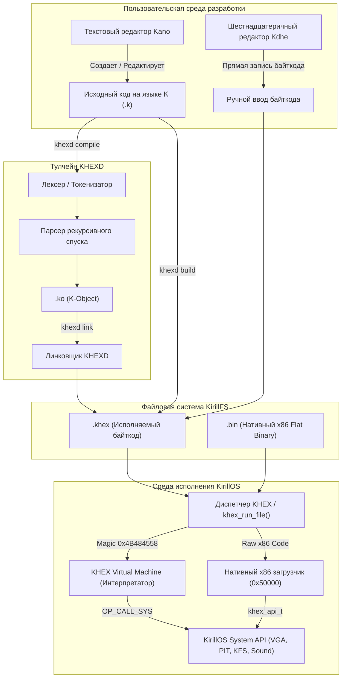

# Подсистема разработки и исполнения программ KirillOS

Добро пожаловать в официальную техническую документацию подсистемы прикладной разработки операционной системы **KirillOS**. 

KirillOS предоставляет полноценную, автономную экосистему для создания, компиляции, отладки и запуска программ: от высокоуровневого языка программирования **K** до низкоуровневого редактирования машинного байткода виртуальной машины **KHEX VM** прямо в операционной системе.

---

## 🗺️ Карта документации

| Документ | Описание |
| :--- | :--- |
| 🚀 [**Загрузчик kboot (`KBOOT.md`)**](file:///d:/cppproject/KirillOS/docs/KBOOT.md) | Полное руководство по нативному двухстадийному загрузчику kboot: архитектура MBR, линия A20, LBA-чтение диска, переключение в Protected Mode, ремап PIC 8259A, прерывания IDT/IRQ1, интерактивный shell, парсер ELF32 и эмуляция Multiboot. |
| 📘 [**Язык программирования K (`K_LANGUAGE.md`)**](file:///d:/cppproject/KirillOS/docs/K_LANGUAGE.md) | Полное руководство по синтаксису языка K (.k): переменные, типы данных, операторы, циклы, ветвления, встроенные функции ввода/вывода, графики VGA, звука PC Speaker и примеры программ. |
| ⚙️ [**Компилятор и Линковщик KHEXD (`COMPILER_AND_LINKER.md`)**](file:///d:/cppproject/KirillOS/docs/COMPILER_AND_LINKER.md) | Внутреннее устройство тулчейна KHEXD: лексер, парсер рекурсивного спуска, кодогенерация, формат объектных файлов `.ko`, линковка в `.khex`, CLI команды. |
| 💻 [**Байткод и Виртуальная машина KHEX VM (`BYTECODE_AND_VM.md`)**](file:///d:/cppproject/KirillOS/docs/BYTECODE_AND_VM.md) | Архитектура стековой ВМ: опкоды, системные вызовы, формат заголовка `khex_exec_header_t`, побайтовый разбор создания программ вручную в hex-редакторе `kdhe`. |

---

## 🏗️ Архитектура подсистемы разработки

Экосистема разработки KirillOS построена по модульному принципу, обеспечивая как запуск компилируемых скриптов на виртуальной машине, так и прямое исполнение нативных x86 бинарников:



---

## ⚡ Быстрый старт: первая программа на языке K

### 1. Написание исходного кода в редакторе Kano
В консоли KirillOS запустите встроенный текстовый редактор:
```text
kano hello.k
```

Введите следующий код:
```rust
fn main() {
    clear()
    color(10, 0)
    print("===============================\n")
    print("   HELLO FROM KIRILLOS K-LANG! \n")
    print("===============================\n")
    beep(523, 100)
    beep(659, 100)
    beep(784, 200)
    color(14, 0)
    print("Lucky number: ")
    var num = rand(100)
    print(num)
    print("\n\nPress any key to exit...")
    var k = getchar()
}
```
Нажмите **F2** для сохранения и **ESC** для выхода в командную строку.

### 2. Сборка программы
Собрать исполняемый файл `.khex` можно одной командой:
```text
khexd build hello.k hello.khex
```
*Компилятор автоматически выполнит трансляцию в промежуточный объектный файл `hello.ko` и слинкует его в `hello.khex`.*

### 3. Запуск программы
Запустите полученный бинарник:
```text
khex run hello.khex
```
*Или просто по имени файла:*
```text
hello.khex
```

---

## 🛠️ Справочник консольных команд KirillOS

### Команды рантайма KHEX
| Команда | Синтаксис | Назначение |
| :--- | :--- | :--- |
| `khex run` | `khex run <файл>` | Запуск исполняемого файла (`.bin` или `.khex`). |
| `khex list` | `khex list` | Отображение списка всех исполняемых бинарных файлов в KirillFS. |
| `khex info` | `khex info <файл>` | Просмотр заголовка, размера, адреса загрузки и первых байт файла. |

### Команды компилятора и линковщика KHEXD
| Команда | Синтаксис | Назначение |
| :--- | :--- | :--- |
| `khexd build` | `khexd build <файл.k> [файл.khex]` | Полная сборка программы (компиляция + линковка за один шаг). |
| `khexd compile` | `khexd compile <файл.k> [файл.ko]` | Компиляция исходного кода в объектный файл `.ko`. |
| `khexd link` | `khexd link <файл.ko> [файл.khex]` | Линковка объектного файла в готовый бинарник `.khex`. |

### Графические приложения и инструменты (Mode 13h)
| Команда | Синтаксис | Назначение |
| :--- | :--- | :--- |
| `kaint` | `kaint [файл.bmp]` | Полноценный графический редактор (Paint) с поддержкой мыши PS/2, 11 инструментов, текста, палитры и экспорта/импорта в `.bmp`. |
| `kcommander` | `kcommander` (или `kc`) | Двухпанельный графический файловый менеджер в стиле Norton Commander (320x200, 256 цветов). |
| `mode13` | `mode13` | Демонстрация легендарного видеорежима VGA 13h (Bresenham, палитра, примитивы). |
| `kfetch` | `kfetch` | Системный информер с цветным логотипом KirillOS, часами CMOS RTC и VGA полосами. |

---

## 👥 Роли и зона ответственности

Разработка подсистемы KHEX, языка K и компилятора ведется в строгом соответствии с архитектурными стандартами KirillOS:
- **Егор**: Архитектура виртуальной машины KHEX VM, синтаксис языка K, компилятор/линковщик KHEXD, стандартные приложения и игры.
- **Интеграция с ядром**: Диспетчеризация системных вызовов в драйверы VGA ([`vga.c`](file:///d:/cppproject/KirillOS/vga.c)), клавиатуры ([`keyboard.c`](file:///d:/cppproject/KirillOS/keyboard.c)), файловой системы ([`kirillfs.c`](file:///d:/cppproject/KirillOS/kirillfs.c)) и звука ([`sound.c`](file:///d:/cppproject/KirillOS/sound.c)).
